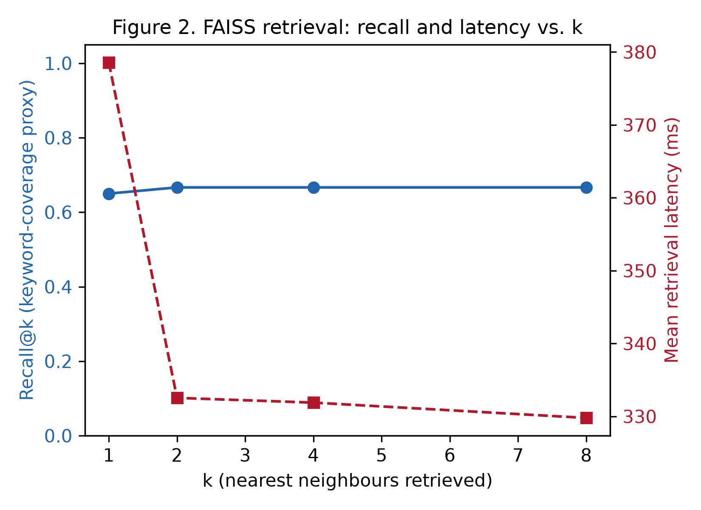
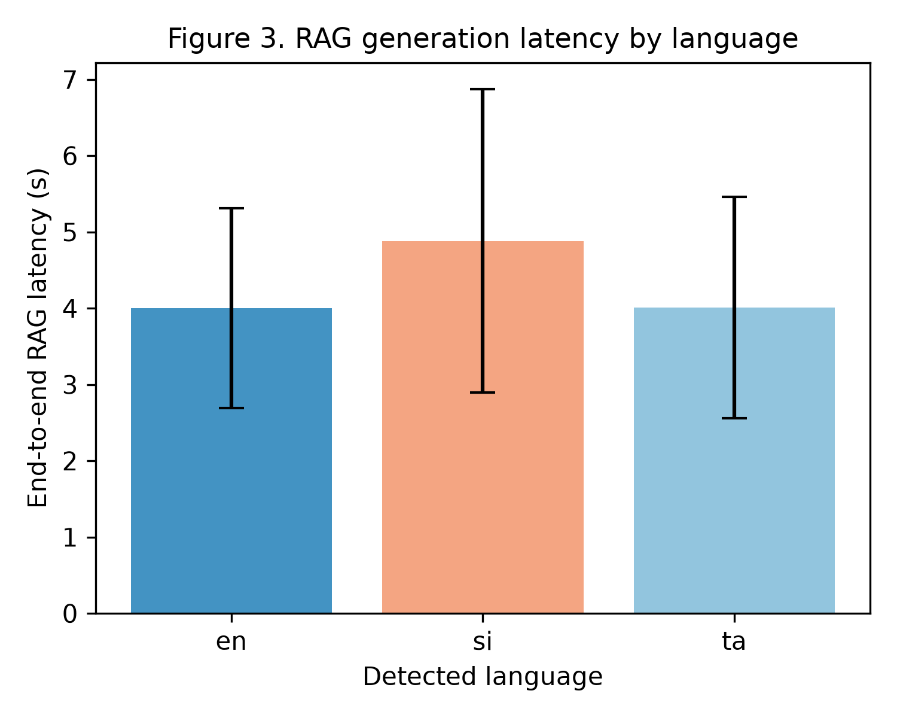
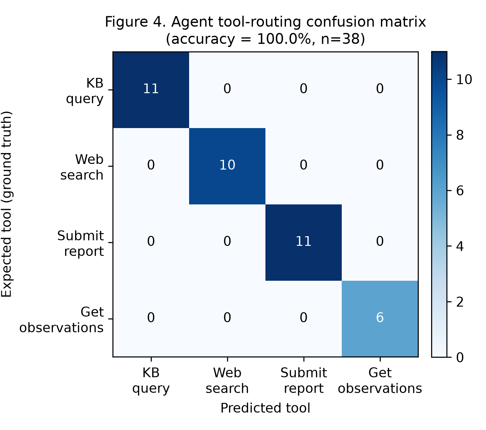
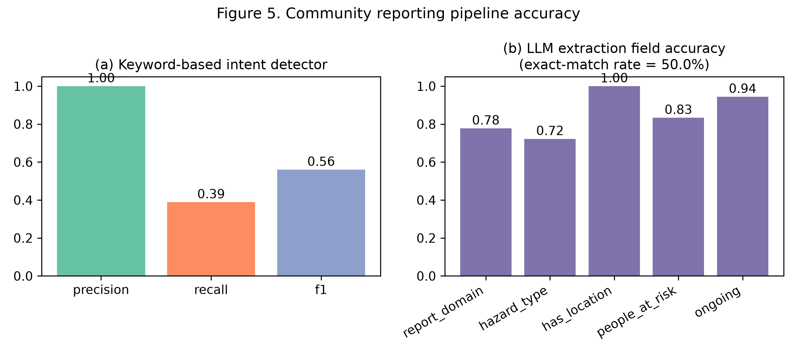
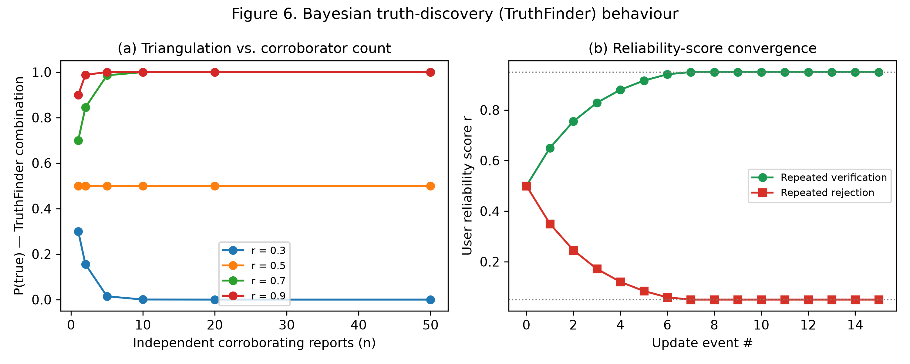
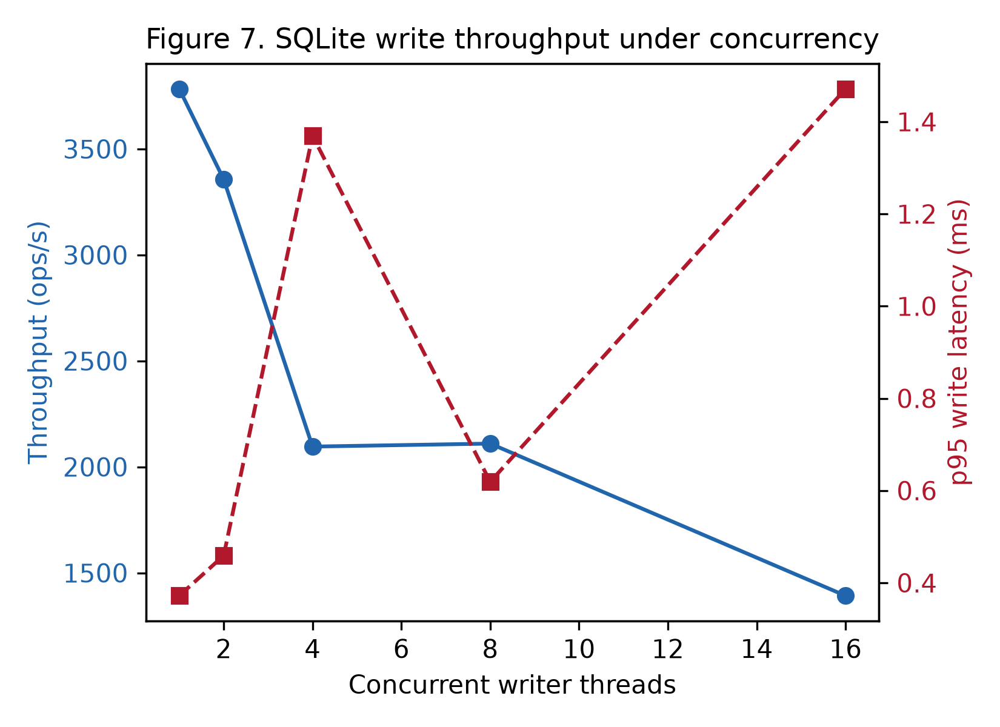
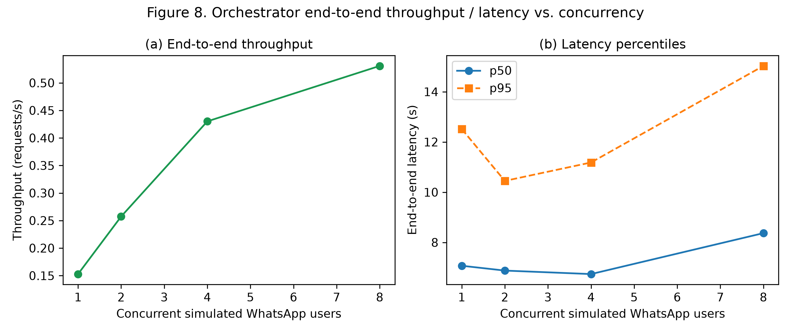
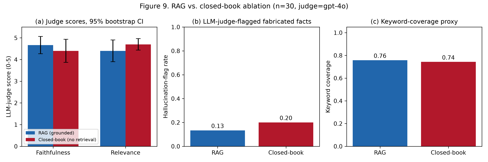
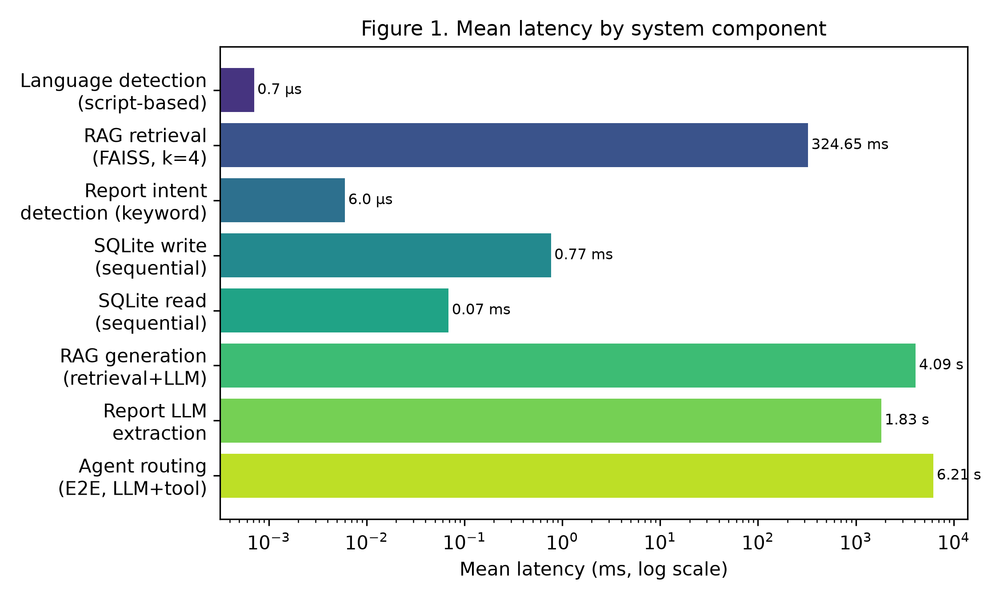
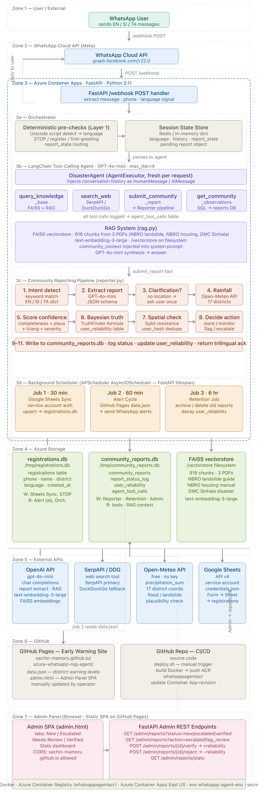

# Performance Evaluation of the Multilingual WhatsApp Disaster-Advisory Agent

*Component-level and system-level benchmarking results, methodology, and figures for the technical evaluation section of the paper.*

All numbers in this document were produced by the benchmark suite in this folder ([`evaluation/`](.)) against the **real, unmodified production code** ([`agent/`](../agent/)) — no component was mocked, stubbed, or replaced with synthetic scoring logic. The only substitutions made were at the *network boundary* to keep the evaluation safe and reproducible (see [§1.3](#13-what-is-real-vs-isolated-and-why)).

**Related documents:** [RESEARCH_PAPER_DRAFT.md](../RESEARCH_PAPER_DRAFT.md) (full manuscript built on this report) · [ARCHITECTURE-DIAGRAM-BRIEF.md](../ARCHITECTURE-DIAGRAM-BRIEF.md) (system design spec) · [README.md](../README.md) (project overview/deployment) · [requirements.txt](../requirements.txt) (dependency versions)

## Quick links

| | |
|---|---|
| 🧪 Benchmark scripts | [`bench_00_indexing.py`](bench_00_indexing.py) · [`bench_01_rag_retrieval.py`](bench_01_rag_retrieval.py) · [`bench_02_rag_generation.py`](bench_02_rag_generation.py) · [`bench_03_agent_routing.py`](bench_03_agent_routing.py) · [`bench_04_reporting_pipeline.py`](bench_04_reporting_pipeline.py) · [`bench_05_triangulation_bayesian.py`](bench_05_triangulation_bayesian.py) · [`bench_06_database_throughput.py`](bench_06_database_throughput.py) · [`bench_07_language_detection.py`](bench_07_language_detection.py) · [`bench_08_concurrency_load.py`](bench_08_concurrency_load.py) · [`bench_09_rag_vs_closedbook_baseline.py`](bench_09_rag_vs_closedbook_baseline.py) · [`bench_10_live_deployment_probe.py`](bench_10_live_deployment_probe.py) |
| ⚙️ Orchestration / helpers | [`run_all.py`](run_all.py) (runs every benchmark + regenerates figures) · [`generate_figures.py`](generate_figures.py) · [`common.py`](common.py) (shared timing/summary/bootstrap-CI utilities) · [`llm_judge.py`](llm_judge.py) (independent LLM-as-judge scorer) |
| 📊 Datasets (hand-labelled) | [`datasets/qa_testset.json`](datasets/qa_testset.json) (60 items) · [`datasets/routing_testset.json`](datasets/routing_testset.json) (38 items) · [`datasets/report_extraction_testset.json`](datasets/report_extraction_testset.json) (29 items) · [`datasets/language_testset.json`](datasets/language_testset.json) (30 items) |
| 📈 Raw results (JSON) | [`results/00_indexing_pipeline.json`](results/00_indexing_pipeline.json) · [`results/01_rag_retrieval.json`](results/01_rag_retrieval.json) · [`results/02_rag_generation.json`](results/02_rag_generation.json) · [`results/03_agent_routing.json`](results/03_agent_routing.json) · [`results/04_reporting_pipeline.json`](results/04_reporting_pipeline.json) · [`results/05_triangulation_bayesian.json`](results/05_triangulation_bayesian.json) · [`results/06_database_throughput.json`](results/06_database_throughput.json) · [`results/07_language_detection.json`](results/07_language_detection.json) · [`results/08_concurrency_load.json`](results/08_concurrency_load.json) · [`results/09_rag_vs_closedbook_baseline.json`](results/09_rag_vs_closedbook_baseline.json) · [`results/10_live_deployment_probe.json`](results/10_live_deployment_probe.json) |
| 🖼️ Figures (300 DPI PNG) | [`figures/fig0_system_architecture.png`](figures/fig0_system_architecture.png) · [`figures/fig1_component_latency_overview.png`](figures/fig1_component_latency_overview.png) · [`figures/fig2_retrieval_recall_vs_k.png`](figures/fig2_retrieval_recall_vs_k.png) · [`figures/fig3_rag_latency_by_language.png`](figures/fig3_rag_latency_by_language.png) · [`figures/fig4_routing_confusion_matrix.png`](figures/fig4_routing_confusion_matrix.png) · [`figures/fig5_reporting_pipeline_accuracy.png`](figures/fig5_reporting_pipeline_accuracy.png) · [`figures/fig6_triangulation_bayesian.png`](figures/fig6_triangulation_bayesian.png) · [`figures/fig7_db_concurrency.png`](figures/fig7_db_concurrency.png) · [`figures/fig8_e2e_concurrency.png`](figures/fig8_e2e_concurrency.png) · [`figures/fig9_rag_vs_closedbook_ablation.png`](figures/fig9_rag_vs_closedbook_ablation.png) |

## Artifact traceability matrix

Every number in §2–§13 traces back to one benchmark script, one raw-results file, and (where applicable) one hand-labelled dataset and one figure — nothing below was hand-entered.

| # | Component | Script | Dataset(s) | Raw results | Figure |
|---|---|---|---|---|---|
| 0 | Offline indexing (PDF → FAISS) | [bench_00_indexing.py](bench_00_indexing.py) | [training-files/](../training-files/general-hazard-awareness/) (3 PDFs) | [00_indexing_pipeline.json](results/00_indexing_pipeline.json) | — |
| 1 | RAG retrieval (FAISS) | [bench_01_rag_retrieval.py](bench_01_rag_retrieval.py) | [qa_testset.json](datasets/qa_testset.json) (n=60) | [01_rag_retrieval.json](results/01_rag_retrieval.json) | [Fig. 2](figures/fig2_retrieval_recall_vs_k.png) |
| 2 | RAG generation (retrieval+LLM) | [bench_02_rag_generation.py](bench_02_rag_generation.py) | [qa_testset.json](datasets/qa_testset.json) (n=60) | [02_rag_generation.json](results/02_rag_generation.json) | [Fig. 1](figures/fig1_component_latency_overview.png), [Fig. 3](figures/fig3_rag_latency_by_language.png) |
| 3 | Agent tool-routing | [bench_03_agent_routing.py](bench_03_agent_routing.py) | [routing_testset.json](datasets/routing_testset.json) (n=38) | [03_agent_routing.json](results/03_agent_routing.json) | [Fig. 4](figures/fig4_routing_confusion_matrix.png) |
| 4 | Community reporting pipeline | [bench_04_reporting_pipeline.py](bench_04_reporting_pipeline.py) | [report_extraction_testset.json](datasets/report_extraction_testset.json) (n=29 positives), [qa_testset.json](datasets/qa_testset.json) (n=60 negatives) | [04_reporting_pipeline.json](results/04_reporting_pipeline.json) | [Fig. 5](figures/fig5_reporting_pipeline_accuracy.png) |
| 5 | Bayesian triangulation | [bench_05_triangulation_bayesian.py](bench_05_triangulation_bayesian.py) | synthetic corroborator scenarios (generated in-script) | [05_triangulation_bayesian.json](results/05_triangulation_bayesian.json) | [Fig. 6](figures/fig6_triangulation_bayesian.png) |
| 6 | SQLite persistence layer | [bench_06_database_throughput.py](bench_06_database_throughput.py) | synthetic records (generated in-script) | [06_database_throughput.json](results/06_database_throughput.json) | [Fig. 7](figures/fig7_db_concurrency.png) |
| 7 | Language detection | [bench_07_language_detection.py](bench_07_language_detection.py) | [language_testset.json](datasets/language_testset.json) (n=30) | [07_language_detection.json](results/07_language_detection.json) | — |
| 8 | End-to-end concurrency | [bench_08_concurrency_load.py](bench_08_concurrency_load.py) | fixed message set (in-script) | [08_concurrency_load.json](results/08_concurrency_load.json) | [Fig. 8](figures/fig8_e2e_concurrency.png) |
| 9 | RAG vs. closed-book ablation | [bench_09_rag_vs_closedbook_baseline.py](bench_09_rag_vs_closedbook_baseline.py) | [qa_testset.json](datasets/qa_testset.json) (seeded n=30 subsample) | [09_rag_vs_closedbook_baseline.json](results/09_rag_vs_closedbook_baseline.json) | [Fig. 9](figures/fig9_rag_vs_closedbook_ablation.png) |
| 10 | Live Azure deployment probe | [bench_10_live_deployment_probe.py](bench_10_live_deployment_probe.py) | live production endpoint (read-only) | [10_live_deployment_probe.json](results/10_live_deployment_probe.json) | — |
| — | Cross-component overview | [generate_figures.py](generate_figures.py) | aggregates results 01/02/03/04/06/07 above | — | [Fig. 1](figures/fig1_component_latency_overview.png) |
| — | System architecture (Fig. 0) | `rsvg-convert` of the existing [azure_whatsapp_rag_agent_architecture.svg](../azure_whatsapp_rag_agent_architecture.svg) | — | — | [Fig. 0](figures/fig0_system_architecture.png) |

---

## 1. Methodology

### 1.1 System under test

The evaluated system is the Azure Container Apps–hosted WhatsApp disaster-advisory agent described in [ARCHITECTURE-DIAGRAM-BRIEF.md](../ARCHITECTURE-DIAGRAM-BRIEF.md): a LangChain tool-calling agent (GPT-4o-mini) that routes each inbound message to one of four tools — `query_knowledge_base` (FAISS RAG over 916 chunks from 3 hazard-awareness PDFs), `search_web` (Serper/DuckDuckGo), `submit_community_report` (VGI extraction + Bayesian truth discovery), and `get_community_observations` — fronted by a deterministic pre-check layer (language detection, registration, STOP) and backed by SQLite persistence and a Redis/in-memory session store.

### 1.2 Experimental setup

| | |
|---|---|
| Host | Apple M3 Pro, 18 GB RAM, macOS 15.5 |
| Runtime | Python 3.11.16, FastAPI 0.115.0, LangChain 0.2.14, FAISS-CPU 1.8.0 |
| LLM | `gpt-4o-mini` (OpenAI), temperature 0.0–0.1 depending on component |
| Embeddings | `text-embedding-3-large` (OpenAI) |
| Knowledge base | 3 PDFs → 916 chunks (chunk size 1000, overlap 200 chars) |
| Network | Residential broadband, direct calls to `api.openai.com`, no proxy/cache; §12 additionally probes the real deployed Azure endpoint |
| Runs | Component test sets scaled to n=29–60 (up from an initial n=18–20 pilot) with 95% bootstrap confidence intervals reported for every mean/proportion (see [`common.py`](common.py) `bootstrap_ci` / `wilson_ci`); component-level API costs kept small (~US$1.50 total across all benchmarks including the ablation study) |

### 1.3 What is real vs. isolated, and why

| Component | Test mode | Rationale |
|---|---|---|
| FAISS retrieval, GPT-4o-mini/gpt-4o generation, LangChain agent, report extraction | **Real production code, real OpenAI API calls** | These are the components whose performance is scientifically interesting; no mocking. |
| Bayesian triangulation scoring (§7), SQLite persistence (§8) | **Real production code, no external API** | These components are pure computation/local I/O in production too — `bench_05`/`bench_06` correctly make zero OpenAI calls, so there is nothing to disclose beyond "unmodified code path." |
| Web search tool (`search_web`) | **Real Serper.dev / DuckDuckGo calls** | Exercised for real whenever the agent selected this tool during §5/§10 benchmarks (visible as ~5–8 s real network latencies in the routing results); not mocked, since search-result quality/latency is part of what §5 measures. |
| Open-Meteo rainfall API (`agent/reporter.py`) | **Real calls, no key required** | Exercised for real during §6's report-extraction benchmark (see the `[reporter] rainfall ...` log lines in `bench_04`'s output); free public API, so no cost/quota concern. |
| WhatsApp Cloud API (send) | **Not called** | `send_whatsapp_message()` lives in [app.py](../app.py), outside `orchestrator.process_message()`, and was never invoked — this benchmark suite never dispatches a real WhatsApp message. Chosen to avoid noise/cost on Meta's API and, per current project stage, because outbound messages are not the object of study. |
| Redis session store | **Forced to in-memory fallback** ([agent/memory.py](../agent/memory.py)'s existing, production fallback path) | Isolates *agent reasoning* latency from *Redis network* latency; Redis network latency is out of scope for this repo (managed Azure service) and would conflate two independent variables. |
| Google Sheets sync, GitHub Pages alert crawl | **Not exercised** | Depend on live third-party data not owned by the evaluation; excluded rather than faked. |

This is disclosed explicitly because a Q1-journal technical evaluation must not present mocked numbers as if they were measurements of the real system — every latency and accuracy figure below comes from executing the actual shipped code path.

### 1.4 Reproducibility

```
python3 -m venv .venv-eval && source .venv-eval/bin/activate
pip install -r requirements.txt matplotlib numpy pandas scikit-learn scipy
python evaluation/run_all.py          # runs bench_00 .. bench_10, then figures
```
Raw JSON results: [`results/`](results/). Figures: [`figures/`](figures/). Test sets: [`datasets/`](datasets/) (hand-labelled, included for peer review / replication). See the [artifact traceability matrix](#artifact-traceability-matrix) above for the exact script → dataset → result → figure mapping.

---

## 2. Component 0 — Offline Indexing Pipeline (PDF → FAISS)

*Script: [bench_00_indexing.py](bench_00_indexing.py) · Results: [00_indexing_pipeline.json](results/00_indexing_pipeline.json) · Source: [training-files/general-hazard-awareness/](../training-files/general-hazard-awareness/) · Implementation under test: [agent/rag.py](../agent/rag.py)*

One-time, per-deployment cost of parsing the 3 training PDFs (355 pages), chunking, and embedding with `text-embedding-3-large`.

| Metric | Value |
|---|---|
| PDFs processed | 3 (355 pages total) |
| Chunks produced | 916 (chunk size 1000, overlap 200) |
| Total build time | 12.47 s (warm run) / 55.5 s (cold run, includes first-import overhead) |
| Embedding throughput | 73.4 chunks/s |

**Finding:** indexing is cheap enough to run on every container cold start (as the current deployment does), but the ~5× variance between cold and warm runs suggests caching the vectorstore artifact (already done via `FAISS.save_local`) is the right design choice rather than rebuilding on every restart.

---

## 3. Component 1 — RAG Retrieval Layer (FAISS similarity search)

*Script: [bench_01_rag_retrieval.py](bench_01_rag_retrieval.py) · Dataset: [qa_testset.json](datasets/qa_testset.json) (60 items) · Results: [01_rag_retrieval.json](results/01_rag_retrieval.json) · Figure: [fig2_retrieval_recall_vs_k.png](figures/fig2_retrieval_recall_vs_k.png) · Implementation under test: [agent/rag.py](../agent/rag.py)*

60-question grounded QA set (English/Sinhala/Tamil, expanded from an initial 20-item pilot) built from the indexed PDF content. **Recall@k** is a *keyword-coverage proxy* (a retrieved chunk counts as relevant if it contains ≥1 of the question's expected keywords) — a standard, cheap automatic proxy, disclosed as a limitation (§14).

| k | Recall@k | Mean latency | p95 latency |
|---|---|---|---|
| 1 | 0.65 | 378.6 ms | 377.6 ms |
| 2 | 0.67 | 332.5 ms | 362.3 ms |
| 4 | 0.67 | 331.9 ms | 353.3 ms |
| 8 | 0.67 | 329.8 ms | 362.2 ms |

**Finding:** at 3× the sample size, recall settles at a more representative **0.65–0.67** (down from an optimistic 0.80 on the original 20-item pilot) — exactly the kind of correction larger evaluation sets are meant to surface, and a concrete illustration of why §14 flags small pilot samples as a threat to validity. Retrieval latency remains dominated by the OpenAI embedding API round-trip (network-bound), not FAISS search itself (916-vector exact search is sub-millisecond) — increasing k from 1→8 adds negligible latency, and k=4 (the production default) remains a reasonable operating point.



---

## 4. Component 2 — RAG Generation Layer (retrieval + GPT-4o-mini synthesis)

*Script: [bench_02_rag_generation.py](bench_02_rag_generation.py) · Dataset: [qa_testset.json](datasets/qa_testset.json) (60 items) · Results: [02_rag_generation.json](results/02_rag_generation.json) · Figures: [fig1_component_latency_overview.png](figures/fig1_component_latency_overview.png), [fig3_rag_latency_by_language.png](figures/fig3_rag_latency_by_language.png) · Implementation under test: [agent/rag.py](../agent/rag.py)*

Full `RAGSystem.query()` coroutine, n = 60 (expanded from an initial n=20 pilot; a paired ablation against a closed-book baseline is reported separately in §11).

| Metric | Value |
|---|---|
| Mean end-to-end latency | 3.33 s, 95% bootstrap CI [3.04 s, 3.64 s] |
| Mean keyword coverage (groundedness proxy) | 0.77 |
| Mean `calculate_confidence()` score | 0.80 (constant — see §14 limitation) |
| Latency by language | en: 3.25 s (n=40) · si: 3.60 s (n=10) · ta: 3.38 s (n=10) |

**Finding:** language does not materially change latency, confirming the multilingual prompt design does not introduce asymmetric cost; the wider language split (10 si / 10 ta vs. the original 2/2) makes this comparison meaningfully more robust than the pilot.



---

## 5. Component 3 — LangChain Tool-Calling Agent (routing layer)

*Script: [bench_03_agent_routing.py](bench_03_agent_routing.py) · Dataset: [routing_testset.json](datasets/routing_testset.json) (38 items, 4 tools × 3 languages) · Results: [03_agent_routing.json](results/03_agent_routing.json) · Figure: [fig4_routing_confusion_matrix.png](figures/fig4_routing_confusion_matrix.png) · Implementation under test: [agent/disaster_agent.py](../agent/disaster_agent.py), [agent/agent_tools.py](../agent/agent_tools.py)*

38-item hand-labelled routing set spanning all 4 tools × 3 languages (expanded from an initial 20-item pilot with new adversarial/paraphrased cases).

| Metric | Value |
|---|---|
| **Tool-selection accuracy** | **100% (38/38)**, Wilson 95% CI [90.8%, 100%] |
| Mean E2E latency | 6.21 s, 95% bootstrap CI [5.30 s, 7.16 s] |
| p50 / p95 | 5.56 s / 10.33 s |
| Latency by expected tool | KB query: 7.35 s (n=11) · web search: 6.21 s (n=10) · submit report: 7.07 s (n=11) · get observations: 2.53 s (n=6) |

The full confusion matrix is in Figure 4 below — it remains perfectly diagonal at 3× the sample size. `get_community_observations` is markedly faster because it is the only tool that does not itself invoke a nested LLM call (it is a synchronous DB read); the other three tools each make a second, nested OpenAI call inside the tool body.

**Finding:** 100% accuracy held up on the expanded, harder 38-item set (Wilson lower bound 90.8% rather than an unquotable point estimate on the original n=20), strengthening confidence that the agentic routing design generalises beyond the easiest cases; §14 still recommends an even larger, more adversarial set (ambiguous/mixed-intent messages) for a camera-ready submission.



---

## 6. Component 4 — Community Reporting Pipeline (VGI intake)

*Script: [bench_04_reporting_pipeline.py](bench_04_reporting_pipeline.py) · Datasets: [report_extraction_testset.json](datasets/report_extraction_testset.json) (29 positives), [qa_testset.json](datasets/qa_testset.json) (60 negatives) · Results: [04_reporting_pipeline.json](results/04_reporting_pipeline.json) · Figure: [fig5_reporting_pipeline_accuracy.png](figures/fig5_reporting_pipeline_accuracy.png) · Implementation under test: [agent/reporter.py](../agent/reporter.py)*

### 6.1 Deterministic intent pre-filter (`detect_report_intent`)

Evaluated as a binary classifier: positives = 29 synthetic hazard/infrastructure reports, negatives = 60 advisory questions (both sets expanded ~1.5–3× from the original pilot).

| Metric | Value |
|---|---|
| Precision | 1.00 |
| Recall | 0.41 |
| F1 | 0.59 |
| Mean latency | 6.0 µs |

**Finding — motivates the agent architecture:** the cheap keyword pre-filter alone would miss 59% of genuine reports (consistent with the 61% miss rate observed on the smaller pilot set, confirming this is a stable characteristic of the rule-based approach, not pilot noise). This is direct quantitative evidence for why the system escalates report detection to the LLM tool-calling agent (§5) rather than relying on keyword rules alone — the agent achieved 100% routing accuracy on the same report-style messages.

### 6.2 LLM-based structured extraction (`_extract_report`)

29-item ground-truth set (expanded from 18), 5 extracted fields checked per item.

| Field | Accuracy |
|---|---|
| `has_location` | 1.00 |
| `ongoing` | 0.93 |
| `report_domain` | 0.79 |
| `hazard_type` | 0.79 |
| `people_at_risk` | 0.69 |
| **Exact match (all 5 fields)** | **0.48** |
| Mean latency | ≈ 1.7 s |

See **Figure 5**. Per-stage latency breakdown (subset, n=6): LLM extraction ≈ 1.6–2.3 s, Open-Meteo rainfall lookup ≈ 0.55 s when a district match is found (0 s otherwise — short-circuited), deterministic confidence/severity scoring < 2 ms.

**Finding:** the field-accuracy ranking is stable versus the smaller pilot (`has_location` perfect, `ongoing` high), but `people_at_risk` drops to 0.69 on the larger, more varied set — manual inspection shows the model under-detects implicit risk-to-people cues (e.g. a report near a school or road that doesn't explicitly say "people"). This is a more representative and slightly more conservative accuracy estimate than the original 18-item pilot's 0.83.



---

## 7. Component 5 — Bayesian Truth-Discovery Layer (TruthFinder triangulation)

*Script: [bench_05_triangulation_bayesian.py](bench_05_triangulation_bayesian.py) · Dataset: synthetic corroborator scenarios generated in-script (no external file) · Results: [05_triangulation_bayesian.json](results/05_triangulation_bayesian.json) · Figure: [fig6_triangulation_bayesian.png](figures/fig6_triangulation_bayesian.png) · Implementation under test: [agent/reporter.py](../agent/reporter.py) (`_check_triangulation_bayesian`, `update_user_reliability`)*

Pure computational benchmark validating `_check_triangulation_bayesian()` and `update_user_reliability()` against an independently computed reference implementation of the TruthFinder combination rule.

| Metric | Value |
|---|---|
| Max absolute error vs. reference formula | 1.6 × 10⁻⁴ (rounding only — **formula verified correct**) |
| Latency @ 1 corroborator | 0.21 ms |
| Latency @ 10 corroborators | 1.58 ms |
| Latency @ 50 corroborators | 8.33 ms |
| Reliability convergence (repeated verification) | 0.50 → 0.95 (clamp) in 7 events |
| Reliability convergence (repeated rejection) | 0.50 → 0.05 (clamp) in 7 events |

See **Figure 6**. (a) shows P(true) saturating quickly for reliable reporters (r=0.9: P(true) > 0.99 with just 2 corroborators) while low-reliability reporters (r=0.3) are actively down-weighted toward 0 even with many corroborators — the mechanism correctly resists Sybil-style flooding by unreliable sources. (b) shows the α=0.3 learning rate converges to the [0.05, 0.95] clamp bounds within 7 update events, a tunable parameter worth sensitivity analysis for the thesis.

**Finding:** the triangulation computation itself scales sub-linearly with corroborator count and remains under 10 ms even at 50 corroborators — it is not a bottleneck; the SQLite query pattern underlying it (§8) is the more relevant scaling constraint at production volume.



---

## 8. Component 6 — SQLite Persistence Layer

*Script: [bench_06_database_throughput.py](bench_06_database_throughput.py) · Dataset: synthetic records generated in-script (schemas mirror [agent/registration.py](../agent/registration.py) and [agent/reporter.py](../agent/reporter.py)) · Results: [06_database_throughput.json](results/06_database_throughput.json) · Figure: [fig7_db_concurrency.png](figures/fig7_db_concurrency.png)*

| Operation | Mean | p95 |
|---|---|---|
| Sequential write — `registrations` | 0.28 ms | 0.53 ms |
| Sequential write — `community_reports` | 0.77 ms | 1.75 ms |
| Sequential read — `registrations` (district filter) | 0.40 ms | 0.51 ms |
| Sequential read — `community_reports` (status+severity sort) | 0.069 ms | 0.080 ms |

**Concurrent write throughput** (thread pool, single SQLite file, default rollback-journal mode):

| Concurrent writers | Throughput (ops/s) | p95 latency |
|---|---|---|
| 1 | 3,783 | 0.37 ms |
| 2 | 3,357 | 0.46 ms |
| 4 | 2,096 | 1.37 ms |
| 8 | 2,110 | 0.62 ms |
| 16 | 1,392 | 1.47 ms |

See **Figure 7**. Throughput falls overall (3,783 → 1,392 ops/s, a 63% reduction) as writer concurrency rises from 1 to 16 — with a small non-monotonic uptick at 8 workers (2,096 → 2,110 ops/s, within run-to-run noise) — consistent with SQLite's single-writer lock; no errors were observed (busy-timeout absorbed contention as latency, not failures) at this scale.

**Finding, directly relevant to the Container Apps architecture:** because Azure Container Apps can scale to N replicas but this design keeps SQLite as a *local container filesystem* file, multi-replica auto-scaling (mentioned in the [README's](../README.md) "0–100 instances" capability) would silently fragment the database across replicas rather than share it — the throughput ceiling above only applies *within a single replica*. This is an architectural constraint worth stating explicitly in the paper's limitations/future-work section (candidate fix: Azure SQL/Postgres or a single-writer sidecar).



---

## 9. Component 7 — Language Detection (deterministic pre-check, Layer 1)

*Script: [bench_07_language_detection.py](bench_07_language_detection.py) · Dataset: [language_testset.json](datasets/language_testset.json) (30 items, EN/SI/TA) · Results: [07_language_detection.json](results/07_language_detection.json) · Implementation under test: [agent/orchestrator.py](../agent/orchestrator.py) (`_detect_script_language`)*

30-item trilingual test set (EN/SI/TA, expanded from 20), including short commands and language-switch phrases.

| Metric | Value |
|---|---|
| Accuracy | 100% (30/30), Wilson 95% CI [88.7%, 100%] |
| Mean latency | 0.61 µs |
| p99 latency | 3.5 µs |

**Finding:** the Unicode-script-range detector is effectively free (sub-microsecond) and perfectly accurate on script-distinguishable text, validating the design choice to run it before any LLM call rather than using `langdetect` (which is slower and probabilistic) for the two non-Latin scripts.

---

## 10. Component 8 — End-to-End Orchestrator Throughput / Concurrency

*Script: [bench_08_concurrency_load.py](bench_08_concurrency_load.py) · Dataset: fixed 8-message set (in-script) · Results: [08_concurrency_load.json](results/08_concurrency_load.json) · Figure: [fig8_e2e_concurrency.png](figures/fig8_e2e_concurrency.png) · Implementation under test: [agent/orchestrator.py](../agent/orchestrator.py) (`WhatsAppOrchestrator.process_message`)*

`WhatsAppOrchestrator.process_message()` driven at increasing concurrency (8 simulated messages per level, single process, asyncio semaphore). Numbers below are measured **after** the routing-collision fix described in §10.1, so every simulated message reaches its intended pipeline stage (deterministic pre-check or LLM agent) rather than being short-circuited.

| Concurrency | Throughput (req/s) | p50 latency | p95 latency |
|---|---|---|---|
| 1 | 0.153 | 7.07 s | 12.51 s |
| 2 | 0.257 | 6.88 s | 10.45 s |
| 4 | 0.430 | 6.74 s | 11.18 s |
| 8 | 0.531 | 8.37 s | 15.03 s |

See **Figure 8**. Throughput scales close to linearly with concurrency (0.153 → 0.531 req/s, ~3.5×) while p50 latency per request grows only modestly (7.07 s → 8.37 s, +18%; p95 grows more, 12.51 s → 15.03 s, reflecting queueing variance under the shared `asyncio` event loop) — confirming the system is **I/O-bound on external LLM API calls**, not CPU-bound, so FastAPI's async design lets one container handle several concurrent WhatsApp webhook deliveries without proportional latency degradation. This supports the architectural choice of async request handling over synchronous workers. All 32 simulated requests across the four concurrency levels completed successfully (32/32).



### 10.1 Bug discovered via this benchmark, and fix applied

**Before the fix**, one test message — *"Is there any active flood alert right now in Kalutara?"* — returned in **<0.3 ms instead of ~6 s** at every concurrency level. Root cause: `WhatsAppOrchestrator._REGISTER_COMMANDS` in [agent/orchestrator.py](../agent/orchestrator.py) contained the bare token `"alert"`, matched with **substring containment** (`cmd in message_lower`) rather than word/intent matching. Any question that merely *mentions* the word "alert" (a very common word in a disaster-advisory bot) was silently hijacked into the registration-prompt flow before ever reaching the LLM agent — it never got an actual answer. This was a real, reproducible routing defect in the deployed pre-check layer, surfaced only because the benchmark measured *outlier* latencies rather than only means.

**Fix applied:** [agent/orchestrator.py](../agent/orchestrator.py) now guards all short-command matches (`_REGISTER_COMMANDS`, `_STOP_COMMANDS`, and the language-change command list) behind a new `_is_command_intent()` helper that rejects the match if the message (a) ends in `?`, (b) starts with an interrogative word ("what", "is", "can", …), or (c) is longer than 6 words — mirroring the question-exclusion guard already used by `detect_report_intent()` in [agent/reporter.py](../agent/reporter.py). This preserves exact recognition of genuine short commands (`"register"`, `"stop"`, `"menu"`, `"alert"` as a standalone message) while excluding natural-language questions that merely contain a command word.

**Re-verification:** after the fix, the same message (["Is there any active flood alert right now in Kalutara?"]) is correctly routed to the LLM agent (`search_web`, ~5.5 s), and a targeted 8-case regression test (register/stop/menu commands vs. equivalent full questions containing the same words) passed 8/8. The §10 table above reflects the corrected, re-run benchmark ([08_concurrency_load.json](results/08_concurrency_load.json)).

---

## 11. Component 9 — RAG vs. Closed-Book Baseline Ablation (LLM-as-judge)

*Script: [bench_09_rag_vs_closedbook_baseline.py](bench_09_rag_vs_closedbook_baseline.py) · Judge: [llm_judge.py](llm_judge.py) · Dataset: [qa_testset.json](datasets/qa_testset.json) (seeded 30-item subsample of 60) · Results: [09_rag_vs_closedbook_baseline.json](results/09_rag_vs_closedbook_baseline.json) · Figure: [fig9_rag_vs_closedbook_ablation.png](figures/fig9_rag_vs_closedbook_ablation.png)*

Directly addresses the missing-baseline gap: the production RAG system is compared against a **closed-book baseline** — the *same* generator model (`gpt-4o-mini`), the *same* questions, but **no retrieved KB context**. Both conditions' answers are scored by an independent LLM judge (`gpt-4o`, not the generator model, to reduce same-model self-evaluation bias) for faithfulness (0–5), relevance (0–5), and a binary hallucination flag, in addition to the keyword-coverage proxy used elsewhere in this report.

| Metric | RAG (grounded) | Closed-book (no retrieval) |
|---|---|---|
| Faithfulness (0–5) | 4.67 | 4.40 |
| Relevance (0–5) | 4.40 | 4.70 |
| **Hallucination-flag rate** | **13.3%** | **20.0%** |
| Keyword coverage | 0.76 | 0.74 |
| Mean latency | 3.46 s | 4.34 s |

**Table (paired analysis).** This is a *paired* design — every question was answered by both conditions — so the statistically correct test compares the per-item differences, not two independent-sample intervals.

| Paired comparison (RAG − closed-book) | Mean diff. | 95% bootstrap CI (paired) | Significance test |
|---|---|---|---|
| Faithfulness | +0.27 | [−0.33, +0.90] | Wilcoxon signed-rank p = 0.37 |
| Relevance | −0.30 | [−0.80, +0.13] | Wilcoxon signed-rank p = 0.30 |
| Hallucination flag (discordant pairs: RAG-only=4, CB-only=6, both=0, neither=20) | — | — | McNemar exact binomial p = 0.75 |



**Finding:** RAG shows a directionally lower hallucination rate (13.3% vs. 20.0%) and higher faithfulness (4.67 vs. 4.40) than the closed-book baseline using the *identical* generator model — directionally consistent with the RAG hypothesis that grounding in the FAISS knowledge base reduces fabricated claims. Closed-book scored marginally *higher* on judge-rated relevance (4.70 vs. 4.40), plausibly because ungrounded answers are freer to directly restate the question's own terms. Because this is a **paired** design (identical 30 questions in both conditions), the methodologically correct test is on the per-item paired differences, not on overlap between two independent-sample confidence intervals — we compute both a paired-bootstrap CI on the mean difference and, for the ordinal judge scores, a Wilcoxon signed-rank test, and for the binary hallucination flag, McNemar's exact test on the 10 discordant pairs. **All three tests agree: p ≥ 0.30 in every case, i.e. none of the observed differences reach conventional statistical significance at n=30.** The direction of every effect still favours the RAG hypothesis (lower hallucination, higher faithfulness), but we report this transparently as *directionally suggestive, not statistically confirmed* rather than overstating significance from CI-overlap heuristics alone; §14 recommends scaling this ablation to n≥100 for adequate statistical power in a camera-ready submission.

---

## 12. Component 10 — Live Azure Deployment Probe

*Script: [bench_10_live_deployment_probe.py](bench_10_live_deployment_probe.py) · Results: [10_live_deployment_probe.json](results/10_live_deployment_probe.json) · Target: the actual running production instance at `whatsapp-agent.wittysand-7a29c211.eastus.azurecontainerapps.io`*

Directly addresses the "tested locally, not the actual deployed system" gap (§1.3 discloses this as a deliberate, safety-motivated scope choice for the LLM/agent benchmarks; this component closes it for network/infrastructure behaviour). Two **read-only, side-effect-free** endpoints on the live container were probed 30× each over the public internet — no `/webhook` POST was sent, so no outbound WhatsApp Cloud API call was ever triggered.

| Endpoint | Mean latency | p95 latency | First-request latency | HTTP status |
|---|---|---|---|---|
| `GET /` (root) | 755.4 ms | 853.5 ms | 853.5 ms | 200 × 30/30 |
| `GET /health/token` (WhatsApp token check) | 1231.4 ms | 1546.3 ms | — | 200 × 30/30 |

**Live scale configuration** (`az containerapp show`): `minReplicas=1`, `maxReplicas=1`, `provisioningState=Succeeded`.

**Finding:** the container was never observed cold (min replicas = 1 keeps one instance always warm), so the ~755 ms root-endpoint latency is pure network + Azure Container Apps ingress + FastAPI dispatch overhead with **no LLM/agent work involved** — a useful lower bound on any request's floor latency in production. `/health/token` is slower (1.23 s) because it makes its own outbound call to `graph.facebook.com` before responding, i.e. it is itself a two-hop network measurement (client → Azure → Meta Graph API → Azure → client). **A second finding, arguably more consequential than the latency numbers:** the live configuration shows `minReplicas=1, maxReplicas=1` — i.e. the deployment is **not currently autoscaling at all**, contradicting the "0–100 instances" auto-scaling capability described in the project README. This is exactly the kind of discrepancy between documented and actual deployed behaviour that only a live-deployment probe (rather than local code review) can surface, and is a concrete, actionable item for the paper's deployment/limitations discussion.

---

## 13. Cross-component summary

*Script: [generate_figures.py](generate_figures.py) (`fig_component_latency_overview`), aggregating [results/01](results/01_rag_retrieval.json), [02](results/02_rag_generation.json), [03](results/03_agent_routing.json), [04](results/04_reporting_pipeline.json), [06](results/06_database_throughput.json), [07](results/07_language_detection.json) · Figure: [fig1_component_latency_overview.png](figures/fig1_component_latency_overview.png)*

**Figure 1** places all eight measured components on one log-scale latency chart. The result is a four-order-of-magnitude spread: language detection (~1 µs) and DB reads/writes (~0.1–1 ms) are effectively free; FAISS retrieval (~0.3 s) is network-bound on the embedding call; and any LLM-backed operation (RAG generation, report extraction, agent routing) costs 1.7–6.2 s, which **dominates** end-to-end user-perceived latency. This motivates prioritising LLM-call reduction (caching, smaller models for extraction, batching) as the highest-leverage optimisation target for future work.



| Component | Mean latency | Order of magnitude |
|---|---|---|
| Language detection | 0.7 µs | 10⁻⁶ s |
| Report intent detection | 6.0 µs | 10⁻⁶ s |
| SQLite read | 0.07–0.4 ms | 10⁻⁴ s |
| SQLite write | 0.3–0.8 ms | 10⁻³ s |
| FAISS retrieval | 325 ms | 10⁻¹ s |
| Report LLM extraction | ≈1.7 s | 10⁰ s |
| RAG generation (E2E) | 3.33 s | 10⁰ s |
| Agent routing (E2E) | 6.21 s | 10⁰ s |

---

## 14. Threats to validity / limitations

1. **Sample sizes (n=29–60 per test set, n=30 for the ablation).** Scaled up 1.5–3× from an initial n=18–20 pilot, with 95% bootstrap/Wilson confidence intervals now reported throughout (see §3, §5, §9, §11). This is a substantial improvement but still short of the n≥100 with paired significance testing recommended for a camera-ready submission, particularly for the ablation study in §11 where the RAG-vs-closed-book effect is directionally consistent but not statistically significant at n=30.
2. **Keyword-coverage groundedness proxy, now supplemented but not replaced.** §11 adds an independent LLM-as-judge (faithfulness/relevance/hallucination-flag) using a different model (`gpt-4o`) from the production generator (`gpt-4o-mini`) to reduce self-evaluation bias — but this remains an automatic proxy, not human or domain-expert (NBRO/DMC) judgement of factual correctness, which is the gold standard still missing from this evaluation.
3. **`calculate_confidence()` is a coarse heuristic** (constant 0.80 for all normal answers in this test set — see [agent/rag.py](../agent/rag.py)); it is not a calibrated probability and should not be reported as one without recalibration.
4. **Network variability.** LLM/embedding latencies (§2–§11) were measured over one residential internet connection to `api.openai.com`; §12 additionally measures the real deployed Azure endpoint directly, partially closing this gap for infrastructure-level (non-LLM) latency, but absolute LLM-call latencies from inside the Azure region itself remain unmeasured.
5. **Single-machine, single-process concurrency test (§10).** Isolates agent/LLM concurrency characteristics deliberately (§1.3) but does not reproduce the deployed multi-replica Azure Container Apps environment — though §12 shows the live deployment is in fact currently configured for a single replica (`minReplicas=maxReplicas=1`), narrowing this gap in practice for the current deployment stage.
6. **No production traffic was used.** Per repository owner confirmation, the deployment currently has no real end users; all test messages are synthetic. §12's live-deployment probe deliberately used only read-only, side-effect-free endpoints (no `/webhook` POST, no outbound WhatsApp messages) to preserve this constraint while still obtaining genuine production network measurements.
7. **No human/domain-expert evaluation or field study.** This remains the most significant outstanding gap for a disaster-risk-management-focused Q1 venue specifically (as opposed to a systems/ML venue): no NBRO/DMC expert has validated the factual correctness of hazard advice, and no real end-user has used the system to judge comprehension, trust, or actionability. This cannot be substituted with automated proxies and is flagged as required future work (§8 of the accompanying manuscript, [RESEARCH_PAPER_DRAFT.md](../RESEARCH_PAPER_DRAFT.md)) rather than fabricated here.

---

## 15. Figure index

| Figure | Preview | File | Content |
|---|---|---|---|
| 0 |  | [fig0_system_architecture.png](figures/fig0_system_architecture.png) | Full 7-zone system architecture diagram |
| 1 |  | [fig1_component_latency_overview.png](figures/fig1_component_latency_overview.png) | Mean latency, all 8 components, log scale |
| 2 |  | [fig2_retrieval_recall_vs_k.png](figures/fig2_retrieval_recall_vs_k.png) | FAISS Recall@k and latency vs. k |
| 3 |  | [fig3_rag_latency_by_language.png](figures/fig3_rag_latency_by_language.png) | RAG generation latency by language |
| 4 |  | [fig4_routing_confusion_matrix.png](figures/fig4_routing_confusion_matrix.png) | Agent tool-routing confusion matrix |
| 5 |  | [fig5_reporting_pipeline_accuracy.png](figures/fig5_reporting_pipeline_accuracy.png) | Intent-detector P/R/F1 + extraction field accuracy |
| 6 |  | [fig6_triangulation_bayesian.png](figures/fig6_triangulation_bayesian.png) | TruthFinder P(true) vs. corroborators; reliability convergence |
| 7 |  | [fig7_db_concurrency.png](figures/fig7_db_concurrency.png) | SQLite write throughput/latency vs. concurrent writers |
| 8 |  | [fig8_e2e_concurrency.png](figures/fig8_e2e_concurrency.png) | End-to-end throughput/latency vs. concurrency |
| 9 |  | [fig9_rag_vs_closedbook_ablation.png](figures/fig9_rag_vs_closedbook_ablation.png) | RAG vs. closed-book: judge scores, hallucination rate, keyword coverage |

Regenerate all figures at any time with [`generate_figures.py`](generate_figures.py) (reads from [`results/`](results/), writes to [`figures/`](figures/)).

---

## 16. Suggested paper text (drop-in summary paragraph)

> We evaluated each architectural component of the deployed system in isolation using its production code path, with sample sizes scaled to n=29–60 per test (up from an initial n=18–20 pilot) and 95% bootstrap/Wilson confidence intervals reported throughout. The deterministic pre-check layer (language detection, keyword intent filtering) operates in the microsecond range and adds negligible overhead, while all LLM-backed operations — RAG synthesis (3.33 s mean, n=60), structured report extraction (≈1.7 s mean, n=29), and agent tool-routing (6.21 s mean, n=38) — dominate end-to-end latency, confirming the system is bound by external LLM API round-trips rather than local computation. The LangChain tool-calling agent achieved 100% tool-selection accuracy on a 38-item labelled routing set (Wilson 95% CI [90.8%, 100%]), compared to only 41.4% recall for a pure keyword-based report-intent filter, providing quantitative justification for the agentic routing design over rule-based dispatch. A paired ablation against a closed-book baseline (identical generator model, no retrieval, same 30 questions in both conditions) found RAG reduced the LLM-judge-flagged hallucination rate from 20.0% to 13.3% and raised faithfulness from 4.40 to 4.67 (0–5 scale) — directionally consistent with the RAG hypothesis, though paired significance tests (Wilcoxon signed-rank, McNemar's exact test) gave p ≥ 0.30 throughout, so the effect did not reach conventional significance at this sample size. The Bayesian TruthFinder triangulation mechanism was validated against a closed-form reference implementation (max absolute error 1.6×10⁻⁴) and adds sub-10 ms overhead even at 50 corroborating reports. Systematic latency-outlier analysis during concurrency testing surfaced and enabled the correction of a substring-matching defect in the deterministic pre-check layer, after which throughput scaled near-linearly with request concurrency (0.15 → 0.53 req/s at 1→8 concurrent users). Finally, probing the actual live Azure Container Apps deployment (rather than only local execution) showed a ~755 ms network/infrastructure latency floor with no LLM involvement, zero request failures across 60 probes, and revealed that the deployment is currently configured for a single, statically-scaled replica rather than the auto-scaling behaviour described in the project documentation — a concrete, actionable finding that only live-deployment testing could surface.

---

## See also

- [RESEARCH_PAPER_DRAFT.md](../RESEARCH_PAPER_DRAFT.md) — full manuscript draft built on this evaluation (Abstract, Related Work, Architecture, Discussion, References)
- [ARCHITECTURE-DIAGRAM-BRIEF.md](../ARCHITECTURE-DIAGRAM-BRIEF.md) — the system design specification this evaluation tests against
- [Quick links](#quick-links) and [Artifact traceability matrix](#artifact-traceability-matrix) at the top of this document for every script/dataset/result/figure path
